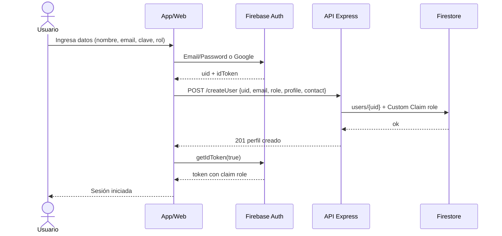
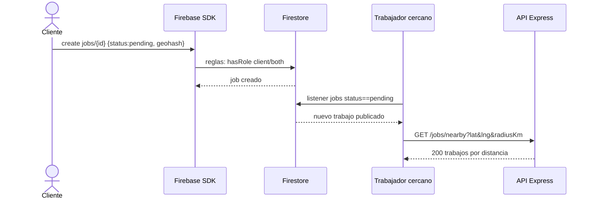
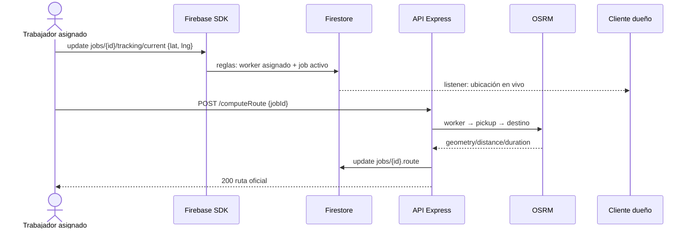
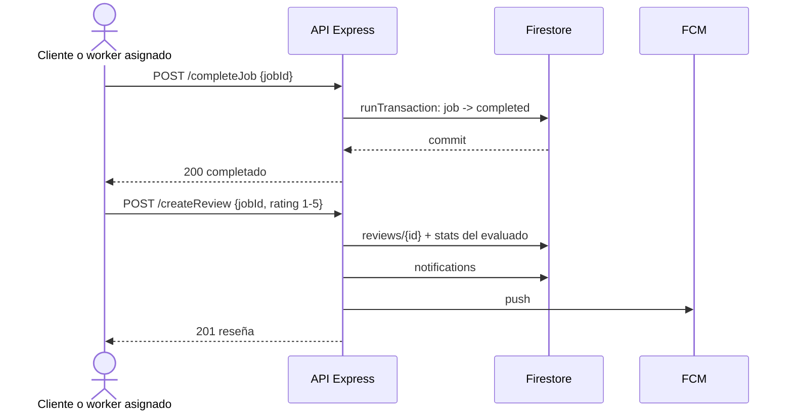

# 01 — Registro, descubrimiento, ejecución, finalización y flujo general

Fuentes Mermaid de las figuras del DERCAS que no tenían módulo previo.
Las figuras de publicación, ofertas y ciclo de vida viven en `02`, `03` y `13`.
Se exportan a `docs/DERCAS/figuras/*.png` (secuencias en tema claro,
flowcharts en tema oscuro) y se compila con `pdflatex` ×2.

## Registro y autenticación → `figuras/registro-y-autenticacion.png`

## Descubrimiento por trabajadores cercanos → `figuras/notificacion-prestadores-de-servicios.png`

Los trabajadores no reciben push al publicarse un trabajo: lo descubren con
listener + `GET /jobs/nearby` (ver `05-modulo-busqueda.md`).

## Ejecución y seguimiento → `figuras/ejecucion-de-un-trabajo.png`

## Finalización y calificación → `figuras/finalizacion-y-calificacion.png`

## Flujo general del sistema → `figuras/flujo-general-de-sistema.png`

```mermaid
sequenceDiagram
    actor C as Cliente
    participant APP as App/Web
    participant AUTH as Firebase Auth
    participant FS as Firestore
    participant API as API Express
    participant FCM as FCM
    actor W as Trabajador
    C->>APP: Publica trabajo
    APP->>FS: SDK directo (rules: client/both)
    W->>FS: Descubre (listener + /jobs/nearby)
    W->>FS: Envía oferta (rules: worker/both)
    C->>API: POST /acceptOffer
    API->>FS: job accepted + conversación active
    API->>FCM: push al trabajador
    C->>API: Chat, voz, ruta y pago (transacciones)
    API->>FS: writes + notifications
    C->>API: POST /completeJob + /createReview
    API->>FCM: push de cierre
```

