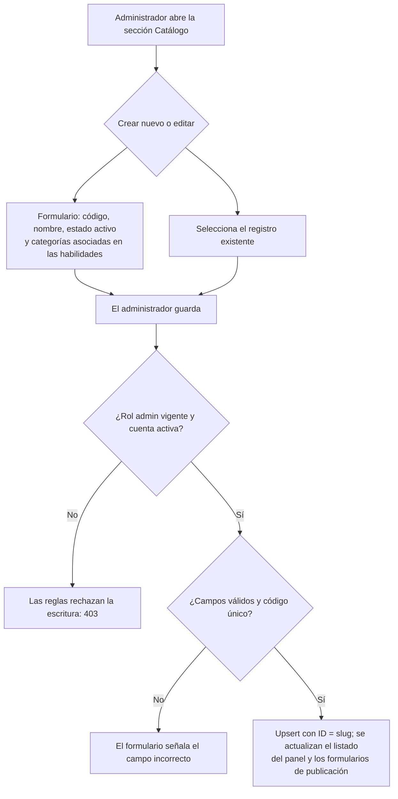

# 07 — Módulo Catálogo (categories / skills)

Proceso asociado: **Configuración del catálogo de servicios** (DERCAS §4.2).
Lectura pública; escritura exclusiva del rol `admin` (reglas de Firestore).

## Uso en el DERCAS

Figura `figuras/flujo-catalogo.png`, sección **Diagrama de flujo de los procesos**.
