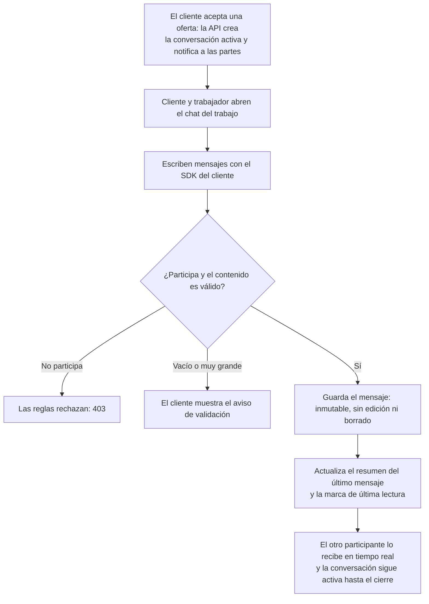

# 08 — Módulo Conversación y coordinación (chat)

Proceso asociado: **Conversación y coordinación** (DERCAS §4.8).
Exactamente una conversación por trabajo, creada por la API al aceptar la oferta.

## Uso en el DERCAS

Figura `figuras/flujo-conversacion.png`, sección **Diagrama de flujo de los procesos**.
