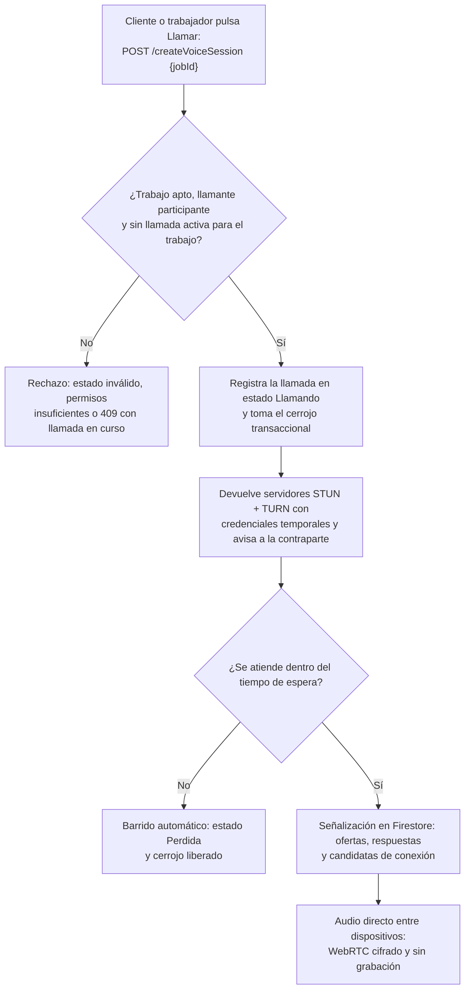
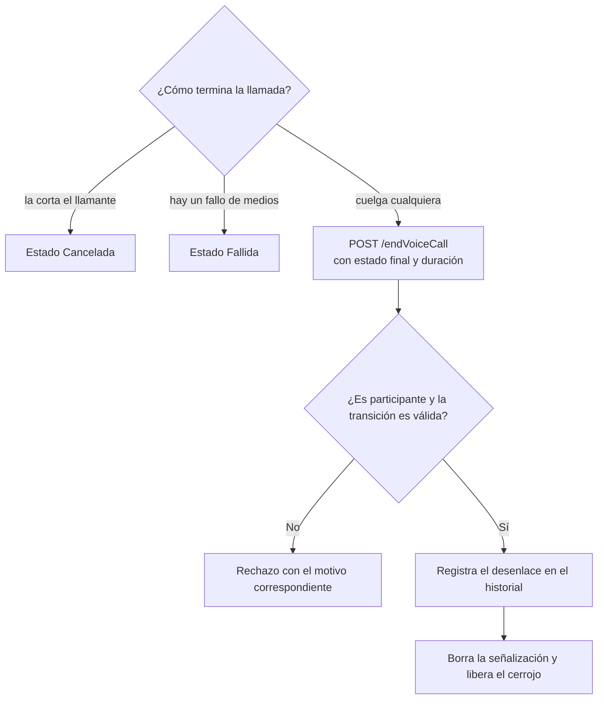

# 09 — Módulo de comunicación de voz (WebRTC + TURN)

Proceso asociado: **Llamada de voz entre las partes** (DERCAS §4.9).
`POST /createVoiceSession` toma el cerrojo; `POST /endVoiceCall` lo libera.
El proceso se ilustra en dos figuras: solicitud y establecimiento, y cierre e historial.

## Figura 1 — Solicitud y establecimiento de la llamada

## Figura 2 — Cierre de la llamada e historial

## Uso en el DERCAS

Figuras `figuras/flujo-llamada-voz-1.png` y `figuras/flujo-llamada-voz-2.png`,
sección **Diagrama de flujo de los procesos**.
