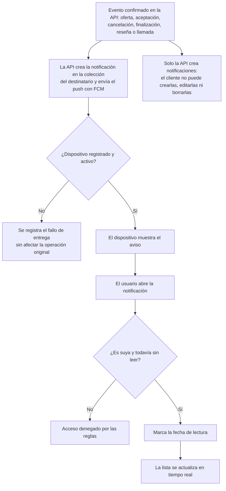

# 10 — Módulo de notificaciones

Proceso asociado: **Notificaciones** (DERCAS §4.11).
Solo la API crea notificaciones; el destinatario únicamente marca lectura.

## Uso en el DERCAS

Figura `figuras/flujo-notificaciones.png`, sección **Diagrama de flujo de los procesos**.
