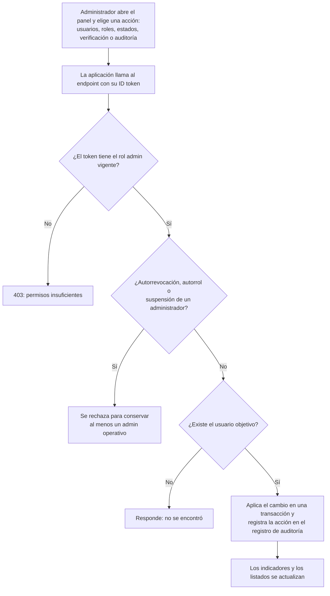

# 11 — Módulo de administración

Proceso asociado: **Administración del sistema** (DERCAS §4.12).
Todas las operaciones pasan por la API y quedan registradas en `activity`.

## Uso en el DERCAS

Figura `figuras/flujo-administracion.png`, sección **Diagrama de flujo de los procesos**.
