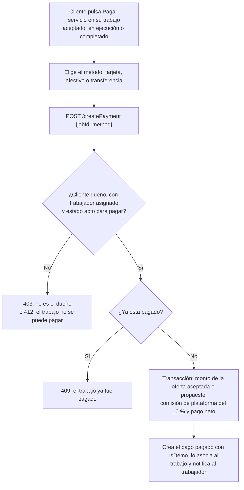

# 12 — Módulo de pago simulado (demo)

Proceso asociado: **Pago simulado del trabajo** (DERCAS §4.13).
`POST /createPayment` — módulo demostrativo: no mueve dinero real (`isDemo: true`).

## Uso en el DERCAS

Figura `figuras/flujo-pago.png`, sección **Diagrama de flujo de los procesos**.
