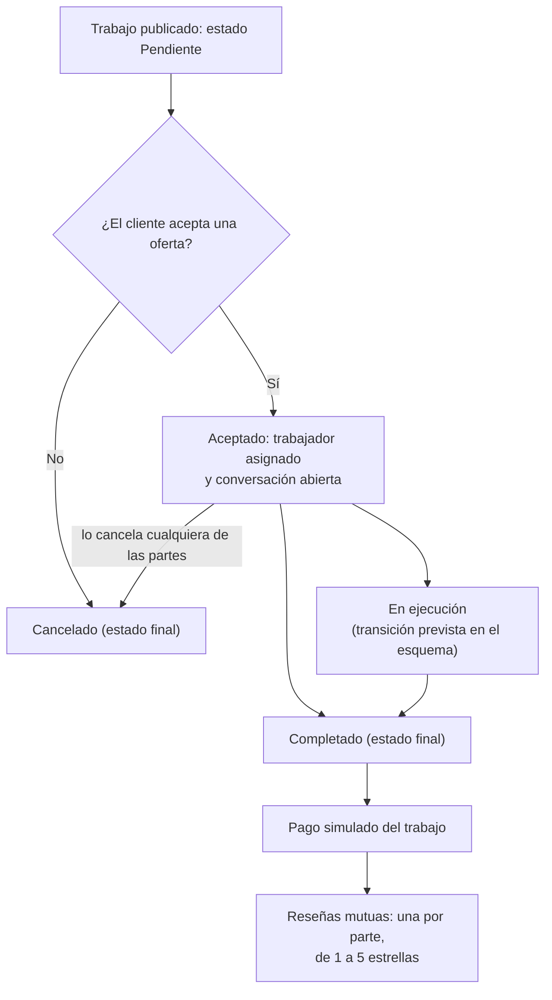

# 13 — Ciclo de vida del trabajo

Proceso asociado: **Diagrama de flujo de los procesos** (DERCAS §5.15).
Muestra el ciclo completo del trabajo, incluidos los pasos posteriores a la finalización.

## Uso en el DERCAS

Figura `figuras/ciclo-de-vida-del-trabajo.png`, sección **Diagrama de flujo de los procesos**.
