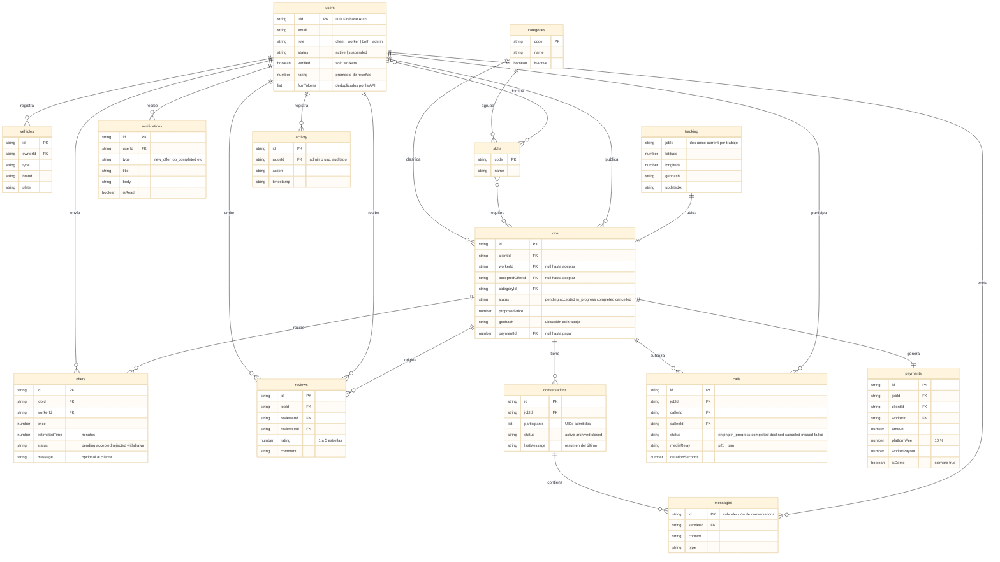

# 14 — Diagrama entidad-relación

Proceso asociado: **Diagrama ER** (DERCAS §9).
Modelo de datos de PaTodo sobre Cloud Firestore: colecciones y referencias por
identificador. Los nombres usan el nombre de la colección (inglés); los rótulos
de las relaciones describen el vínculo en español.

Firestore no impone claves foráneas: las relaciones son referencias lógicas que
las reglas de seguridad y la API mantienen consistentes. Las subcolecciones
(`messages`, `tracking`) se indican en el texto del DERCAS, no con una entidad aparte.



## Uso en el DERCAS

Figura `figuras/diagrama-er.png`, sección **Diagrama ER**.
```