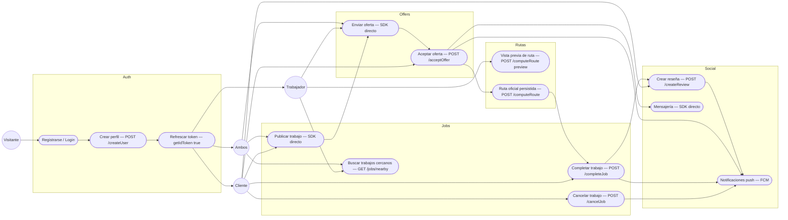
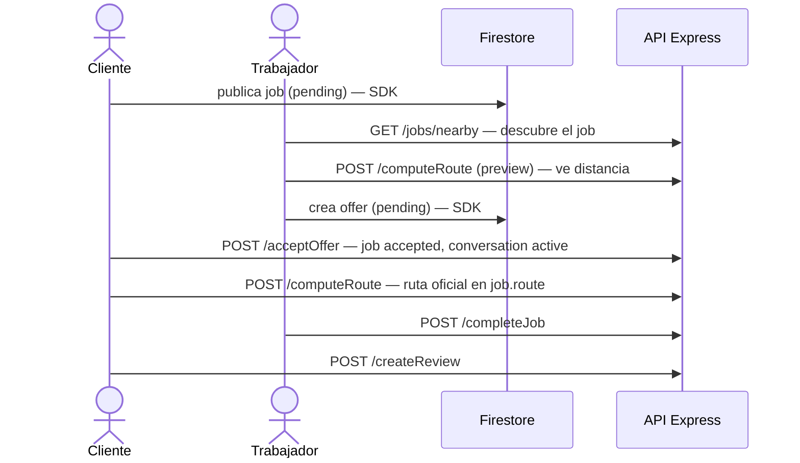

# 01 — Casos de uso del sistema

## Actores y roles

- **Visitante**: sin sesión.
- **Cliente** (`role: client`): publica trabajos, elige ofertas, califica.
- **Trabajador** (`role: worker`): busca trabajos cercanos, oferta, ejecuta.
- **Ambos** (`role: both`): puede actuar en los dos papeles.
- **Sistema** (API + Firebase): orquesta transacciones, rutas y notificaciones.

## Diagrama de casos de uso

## Flujo feliz (happy path)

