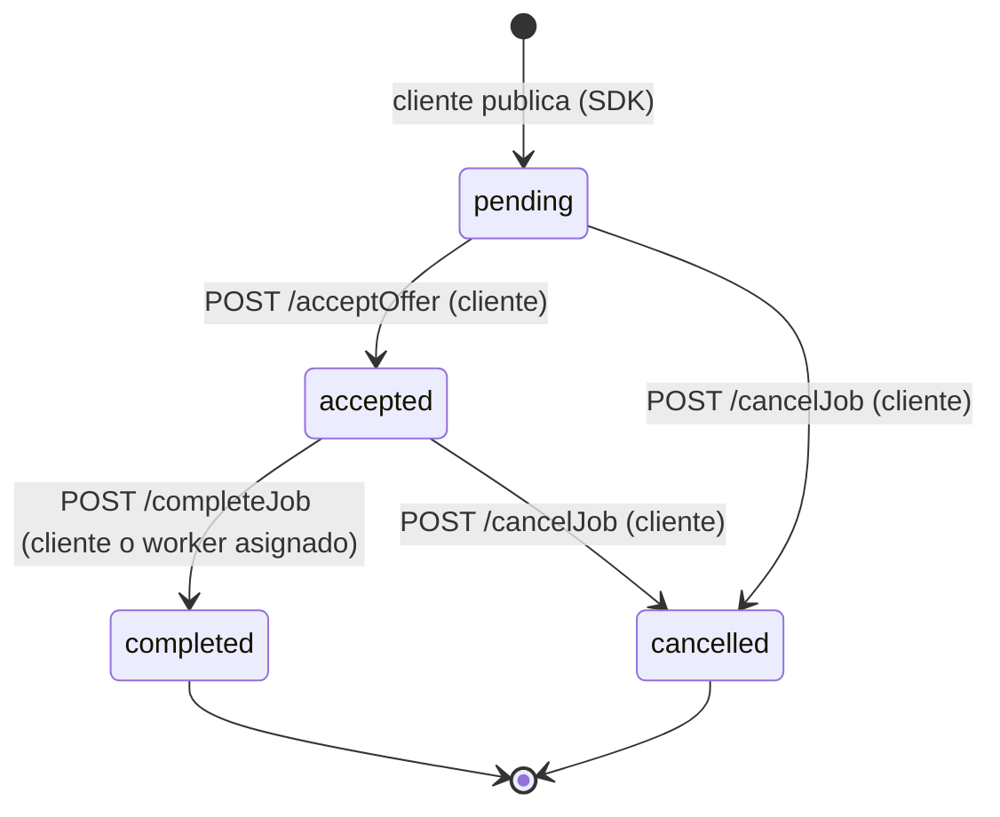
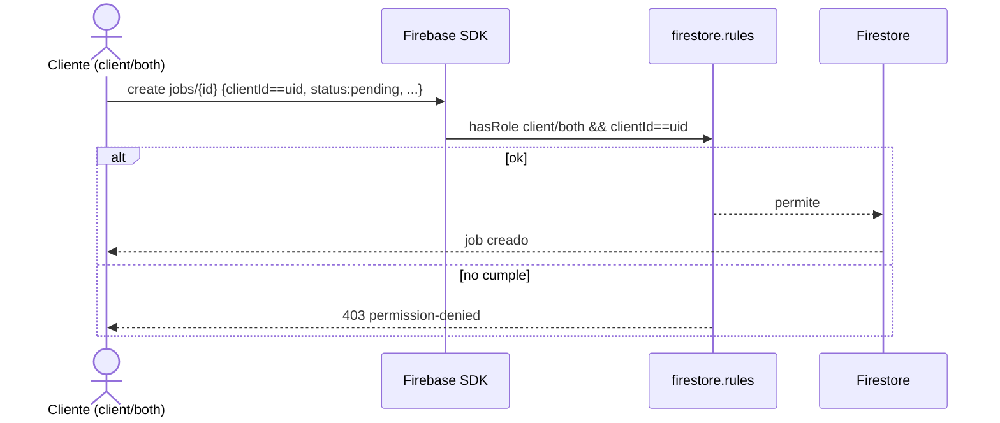
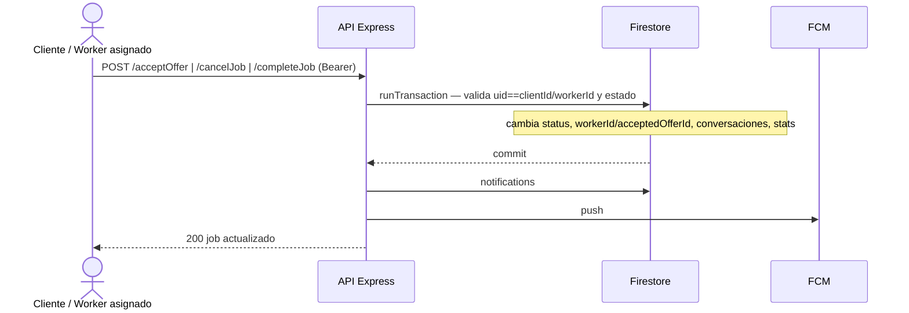

# 02 — Módulo Jobs

## Estados

```mermaid
stateDiagram-v2
    [*] --> pending : cliente publica (SDK)
    pending --> accepted : POST /acceptOffer (cliente)
    pending --> cancelled : POST /cancelJob (cliente)
    accepted --> completed : POST /completeJob (cliente o worker asignado)
    accepted --> cancelled : POST /cancelJob (cliente)
    completed --> [*]
    cancelled --> [*]
```

## Escritura directa — publicar

```mermaid
sequenceDiagram
    actor C as Cliente (client/both)
    participant SDK as Firebase SDK
    participant R as firestore.rules
    participant FS as Firestore

    C->>SDK: create jobs/{id} {clientId==uid, status:pending, ...}
    SDK->>R: hasRole client/both && clientId==uid
    alt ok
        R-->>FS: permite
        FS-->>C: job creado
    else no cumple
        R-->>C: 403 permission-denied
    end
```

## Transacciones — aceptar / cancelar / completar

```mermaid
sequenceDiagram
    actor U as Cliente / Worker asignado
    participant API as API Express
    participant FS as Firestore
    participant FCM as FCM

    U->>API: POST /acceptOffer | /cancelJob | /completeJob (Bearer)
    API->>FS: runTransaction — valida uid==clientId/workerId y estado
    Note over FS: cambia status, workerId/acceptedOfferId, conversaciones, stats
    FS-->>API: commit
    API->>FS: notifications
    API->>FCM: push
    API-->>U: 200 job actualizado
```
