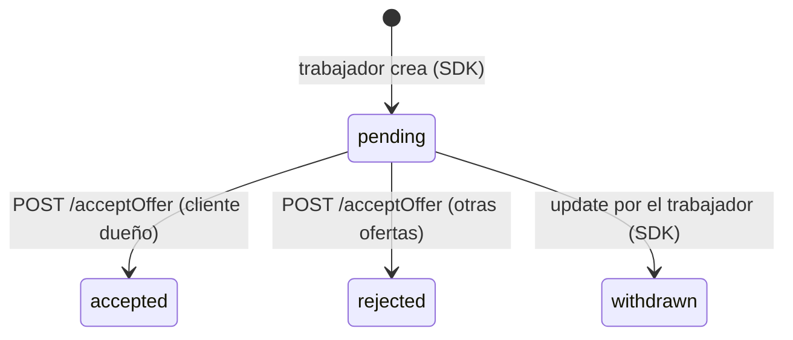
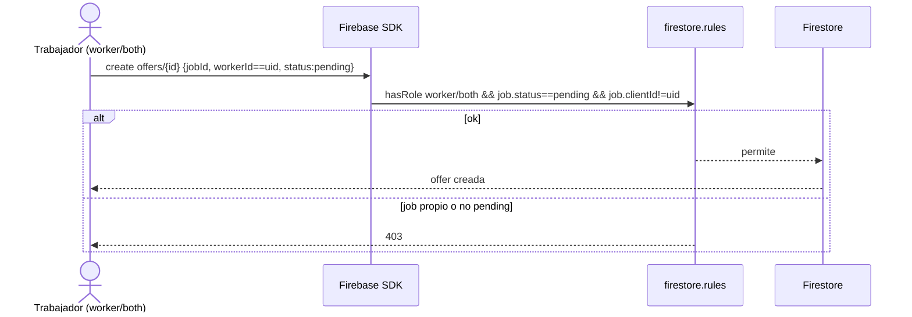
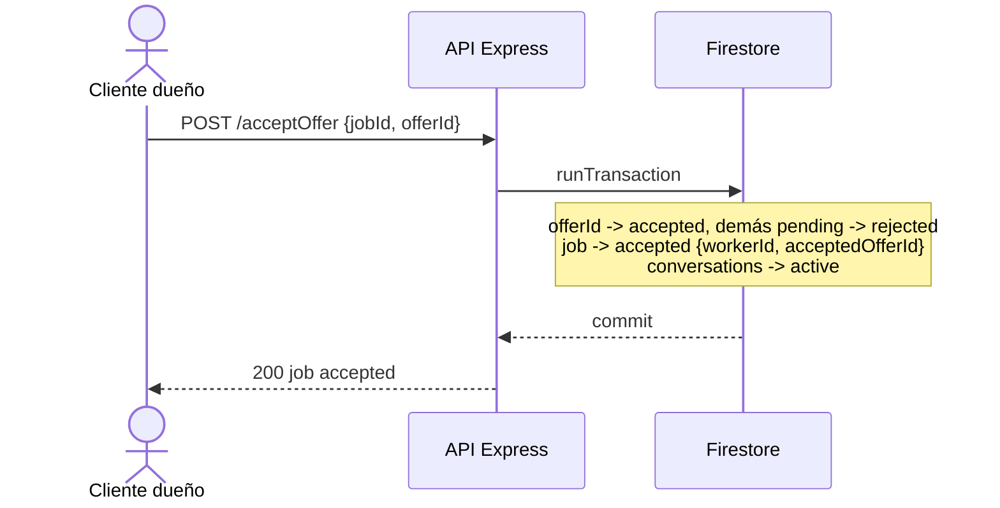

# 03 — Módulo Offers

## Estados de una oferta

```mermaid
stateDiagram-v2
    [*] --> pending : trabajador crea (SDK)
    pending --> accepted : POST /acceptOffer (cliente dueño)
    pending --> rejected : POST /acceptOffer (otras ofertas)
    pending --> withdrawn : update por el trabajador (SDK)
```

## Enviar oferta (SDK directo)

```mermaid
sequenceDiagram
    actor T as Trabajador (worker/both)
    participant SDK as Firebase SDK
    participant R as firestore.rules
    participant FS as Firestore

    T->>SDK: create offers/{id} {jobId, workerId==uid, status:pending}
    SDK->>R: hasRole worker/both && job.status==pending && job.clientId!=uid
    alt ok
        R-->>FS: permite
        FS-->>T: offer creada
    else job propio o no pending
        R-->>T: 403
    end
```

## Aceptar oferta (transacción)

```mermaid
sequenceDiagram
    actor C as Cliente dueño
    participant API as API Express
    participant FS as Firestore

    C->>API: POST /acceptOffer {jobId, offerId}
    API->>FS: runTransaction
    Note over FS: offerId -> accepted, demás pending -> rejected<br/>job -> accepted {workerId, acceptedOfferId}<br/>conversations -> active
    FS-->>API: commit
    API-->>C: 200 job accepted
```
