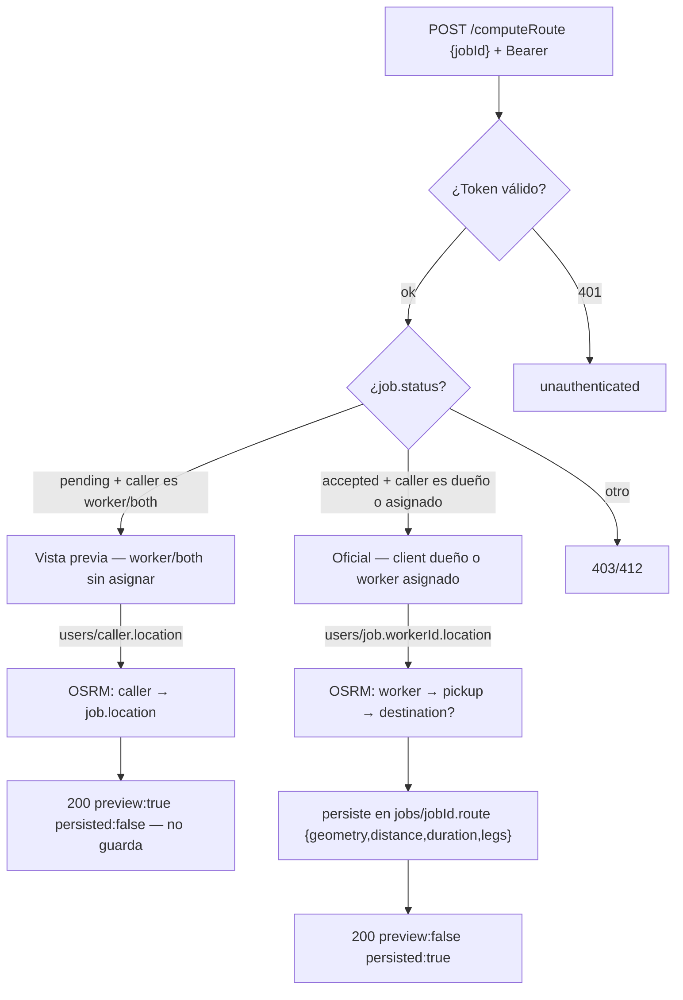
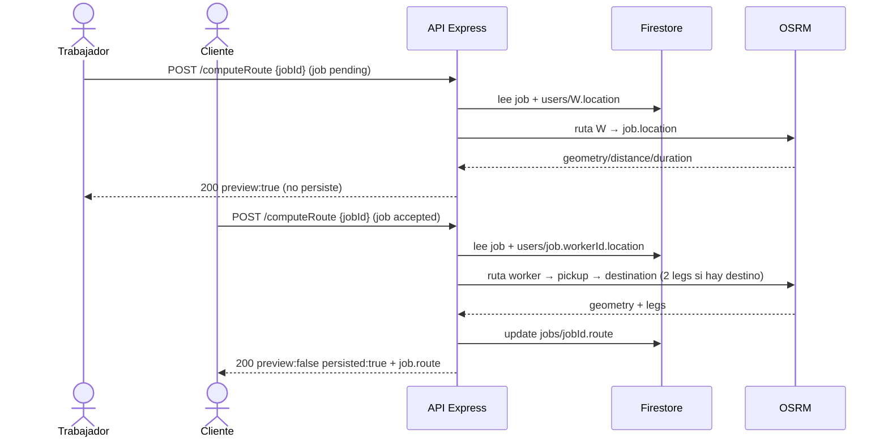

# 04 — Módulo Rutas (trazo geográfico)

`POST /computeRoute` — dos modos según si el trabajo ya tiene trabajador asignado.

## Secuencia — vista previa vs oficial

> Pintado en el mapa: `geometry.coordinates` es GeoJSON `[lng,lat]` → `L.polyline` / `Polyline` / `flutter_map`.
