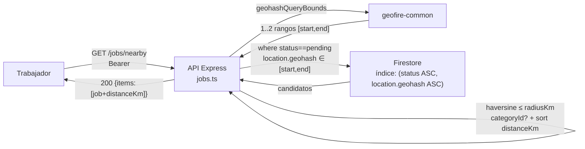
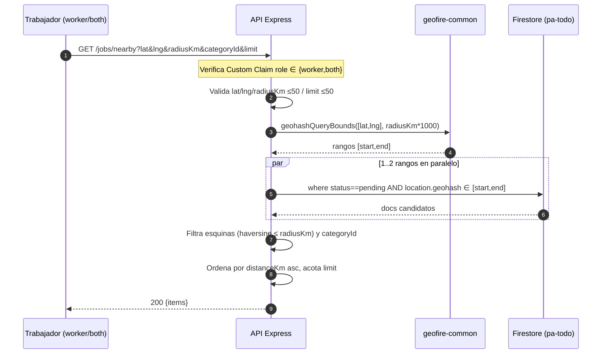

# 05 — Módulo Búsqueda (trabajos cercanos)

`GET /jobs/nearby?lat&lng&radiusKm&categoryId&limit` — solo `worker`/`both`.

## Arquitectura

## Secuencia

## Errores

| Código | Cuándo |
|---|---|
| `400 invalid-argument` | `lat/lng` no numéricos, fuera de rango, `radiusKm ≤0` o `>50` |
| `401 unauthenticated` | sin `Bearer` |
| `403 permission-denied` | `role` es `client` |
