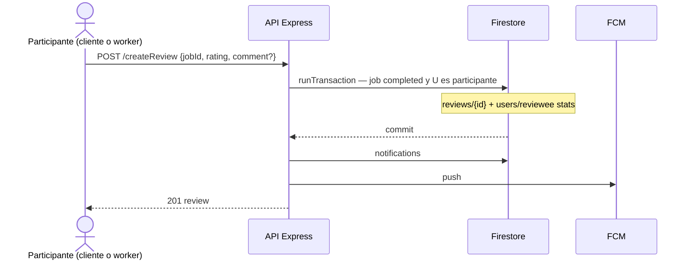
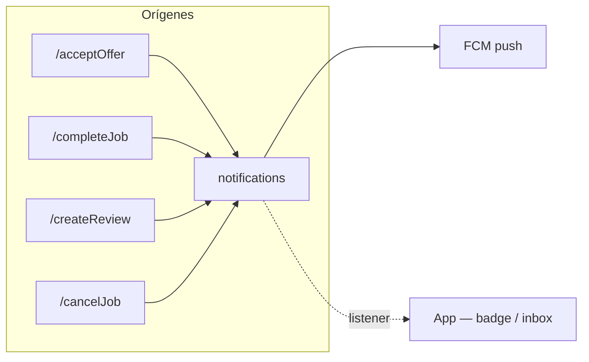

# 06 — Módulo Reviews y Notificaciones

Solo la API puede crear estos documentos; las reglas bloquean la escritura directa.

```mermaid
sequenceDiagram
    actor U as Participante (cliente o worker)
    participant API as API Express
    participant FS as Firestore
    participant FCM as FCM

    U->>API: POST /createReview {jobId, rating, comment?}
    API->>FS: runTransaction — job completed y U es participante
    Note over FS: reviews/{id} + users/reviewee stats
    FS-->>API: commit
    API->>FS: notifications
    API->>FCM: push
    API-->>U: 201 review
```

```mermaid
flowchart LR
    subgraph Orígenes
        A["/acceptOffer"] --> N["notifications"]
        B["/completeJob"] --> N
        C["/createReview"] --> N
        D["/cancelJob"] --> N
    end
    N --> FCM["FCM push"]
    N -.->|"listener"| APP["App — badge / inbox"]
```
