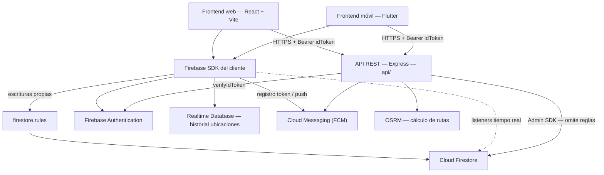

# Diagramas de PaTodo

> Stack real: **Firebase gestionado** (Auth, Firestore, FCM, Realtime Database, Storage) + **API REST** Express 5 en `api/` (Render). No hay Cloud Functions ni Spring/MongoDB. La spec es `spec/openapi.yaml`.

Los diagramas usan [Mermaid](https://mermaid.js.org/). Convención: **flecha sólida = llamada**, **punteada = lectura indirecta / listener**.

## Índice

| # | Diagrama | Archivo |
|---|----------|---------|
| 0 | Vista general (este archivo §1) | `backend-dominios.md` |
| 1 | Casos de uso del sistema | `01-casos-uso.md` |
| 2 | Módulo Jobs — ciclo de vida | `02-modulo-jobs.md` |
| 3 | Módulo Offers — ofertas | `03-modulo-offers.md` |
| 4 | Módulo Rutas — trazo geográfico | `04-modulo-rutas.md` |
| 5 | Módulo Búsqueda — trabajos cercanos | `05-modulo-busqueda.md` |
| 6 | Módulo Reviews / Notificaciones | `06-modulo-reviews-notifs.md` |

---

## 1. Vista general — componentes y dos caminos

Los frontends tienen **dos caminos** excluyentes: SDK directo (datos propios) y API (transacciones).

**Lectura**

- El SDK mantiene sesión, escucha cambios y envía ubicaciones a RTDB.
- Escrituras directas **siempre pasan por `firestore.rules`** (autorización por `uid` y `role`).
- La API es el único componente con Admin SDK: verifica el `idToken` y ejecuta transacciones.
- No hay Cloud Functions; su código quedó en `docs/functions-legacy/`.

### Responsabilidades por componente

| Componente | Escribe | Lee |
|---|---|---|
| Frontends (React/Flutter) | Sus documentos vía SDK: `jobs` (cliente), `offers` (trabajador), `messages`, perfil propio | Todo lo permitido por `firestore.rules` |
| API Express (`api/`) | `users`, `jobs`, `offers`, `conversations`, `reviews`, `notifications` (transacciones) | Todo (Admin SDK) |
| `firestore.rules` | — árbitro — | — |
| Firebase Auth | — | ID tokens (`Bearer`) |
| OSRM | — | Coordenadas → ruta en `jobs.route` |
