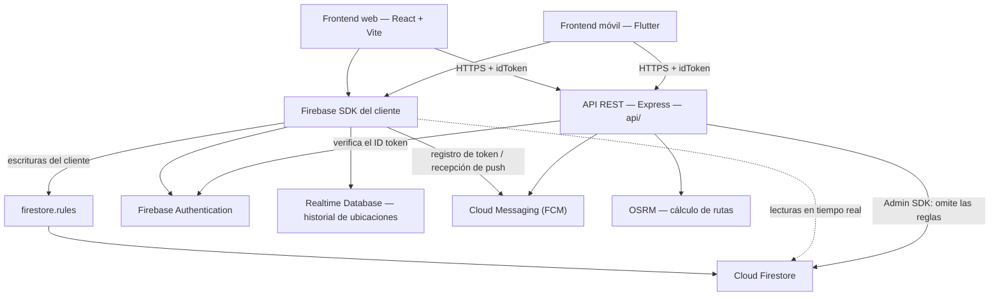
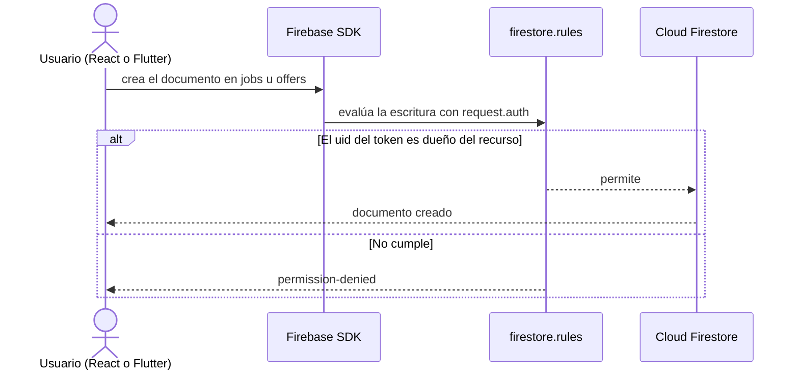
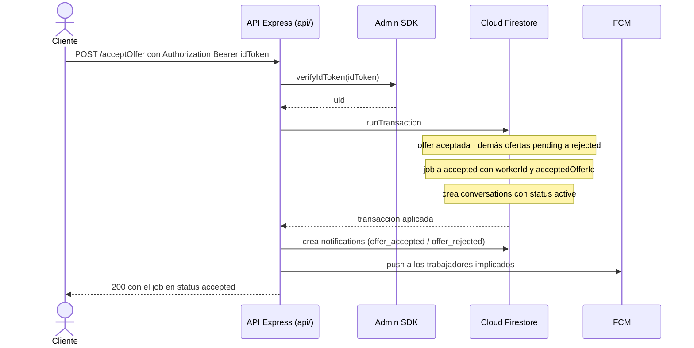
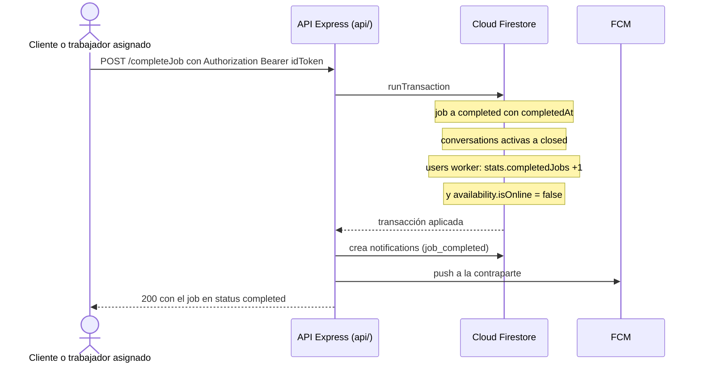

# Diagramas de PaTodo — Componentes y Conexiones

Documento de apoyo para explicar la arquitectura real del proyecto: **Firebase gestionado**
(Auth, Firestore, FCM, Realtime Database) más una **API REST transaccional** en Express
(`api/`). Complementa a [`docs/arquitectura.md`](../arquitectura.md), que define las reglas;
aquí se visualiza **qué componentes existen y cómo se conectan entre sí**.

> Los diagramas están en formato [Mermaid](https://mermaid.js.org/). Zed y GitHub los renderizan
> automáticamente al abrir este archivo. La convención es **flecha sólida = llamada real** y
> **flecha punteada = relación de lectura/escritura indirecta**.

---

## 1. Vista general

Los frontends tienen **dos caminos**: el SDK de Firebase (autenticación, lecturas en tiempo real
y escrituras sobre documentos propios) y la API Express (operaciones transaccionales).

**Lectura del diagrama**

- El **SDK del cliente** mantiene la sesión (`Auth`), escucha cambios (`Firestore`), envía el
  historial de ubicaciones (`Realtime Database`) y recibe notificaciones (`FCM`).
- Las escrituras directas del cliente **siempre pasan por `firestore.rules`**, que las autoriza
  según el `uid` del token.
- La **API Express** es el único componente con el Admin SDK: verifica el ID token de cada
  petición y ejecuta las transacciones, **omitiendo las reglas** de Firestore.
- No hay Cloud Functions en el diagrama porque **no existen** en este proyecto: su lógica quedó
  archivada en `docs/functions-legacy/`.

---

## 2. Responsabilidades por componente

| Componente | Escribe | Lee |
|---|---|---|
| Frontends (React/Flutter) | Sus propios documentos vía SDK: `jobs` (cliente), `offers` (trabajador), `messages`, perfil propio, `fcmTokens` | Todo lo permitido por `firestore.rules` |
| API Express (`api/`) | `users`, `jobs`, `offers`, `conversations`, `reviews`, `notifications` (dentro de transacciones) | Todo (Admin SDK) |
| `firestore.rules` | — (es el árbitro) | — |
| Firebase Auth | — | ID tokens de las peticiones con `Bearer` |
| OSRM | — | Coordenadas del trabajador y del trabajo → ruta guardada en `jobs.route` |

Los endpoints disponibles y quién puede llamarlos están en
[`docs/arquitectura.md`](../arquitectura.md#3-api-rest-express).

---

## 3. Escritura directa: publicar un trabajo o enviar una oferta

El cliente no pasa por la API: escribe el documento y las reglas deciden.

---

## 4. Operación transaccional: aceptar una oferta (`POST /acceptOffer`)

Secuencia real de la API: autentica, ejecuta la transacción y notifica fuera de ella.

---

## 5. Operación transaccional: completar un trabajo (`POST /completeJob`)

