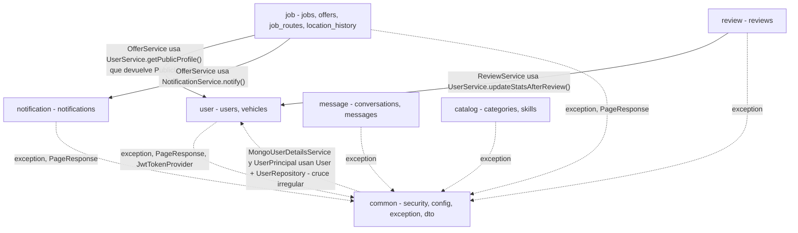
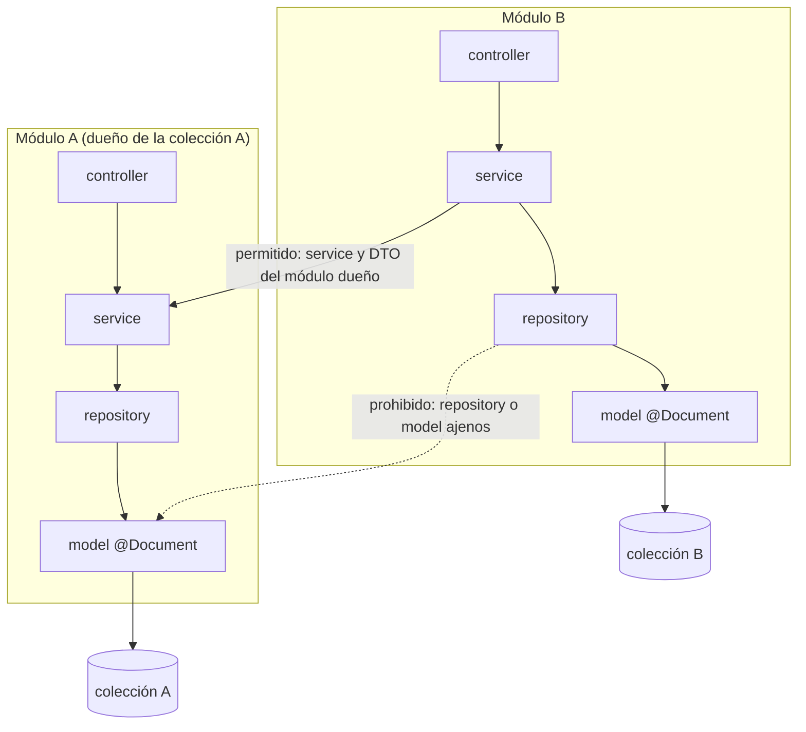
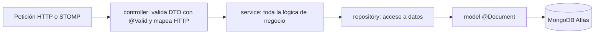
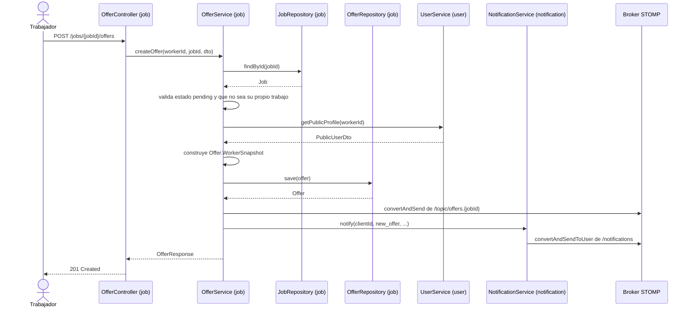

# Diagramas del Backend — Dominios y Conexiones

Documento de apoyo para explicar el **monolito modular** del backend (`PaTodo/backend`).
Complementa a [`docs/arquitectura.md`](../arquitectura.md), que define las reglas; aquí se
visualiza **qué dominios existen y cómo se conectan entre sí**.

> Los diagramas están en formato [Mermaid](https://mermaid.js.org/). Zed y GitHub los renderizan
> automáticamente al abrir este archivo. La convención es **flecha sólida = dependencia de negocio**
> y **flecha punteada = dependencia a `common` o cruce irregular**.

---

## 1. Dominios y sus colecciones

| Módulo | Colecciones (MongoDB Atlas, base `paTodo`) | Servicios principales |
|---|---|---|
| `user` | `users`, `vehicles` | `AuthService`, `UserService`, `VehicleService` |
| `job` | `jobs`, `offers`, `job_routes`, `location_history` | `JobService`, `OfferService`, `JobRouteService`, `LocationService` |
| `message` | `conversations`, `messages` | `MessageService` |
| `review` | `reviews` | `ReviewService` |
| `catalog` | `categories`, `skills` | `CategoryService`, `SkillService` |
| `notification` | `notifications` | `NotificationService` |
| `common` | *(ninguna)* | Seguridad JWT, config y manejo de errores transversales |

---

## 2. Vista general: dominios y dependencias

Muestra los 7 módulos y las **únicas dependencias que cruzan** entre ellos.
Las flechas sólidas son llamadas reales entre servicios; las punteadas representan el uso de
`common` (permitido) y el único cruce que **viola la regla de oro** (`common` hacia `user`).

**Lectura del diagrama**

- `job` es el dominio **núcleo** y el que más se conecta: consulta `user` (para armar el
  *snapshot* del trabajador) y `notification` (para avisar de nuevas ofertas).
- `review` escribe en `user` para actualizar el promedio de calificación.
- Todos los módulos usan `common` para excepciones y paginación; solo `user` usa `common.security`
  (`JwtTokenProvider`) al emitir tokens.
- La flecha punteada `common` hacia `user` es la **única dependencia que rompe el aislamiento**:
  la capa de seguridad necesita el modelo y el repositorio de `user` para autenticar.
- `message`, `catalog` y `notification` están **completamente desacoplados** del resto (solo dependen de `common`).

---

## 3. Estructura interna de un módulo y la "regla de oro"

Cada dominio encapsula sus propias capas. La regla **no negociable** es que un módulo **solo**
toca sus colecciones a través de su propio `repository`, y que **nunca** importa el `model` ni el
`repository` de otro módulo; si necesita datos ajenos, usa el **servicio o DTO del módulo dueño**.

Y la ruta que sigue una petición dentro de un módulo:

---

## 4. Ejemplo concreto: trabajador envía una oferta

Secuencia real de `POST /jobs/{jobId}/offers`, donde se ven en acción los cruces de `job` hacia
`user` y hacia `notification` de la sección 2.

> Nota: `job` **no** guarda una referencia viva al `User`; copia los datos que necesita en el
> `WorkerSnapshot` dentro del documento `Offer`. Así el dominio queda aislado aunque el usuario cambie
> después.

---

## 5. Estado del aislamiento

- ✅ Ningún módulo (salvo `common`) importa `model` ni `repository` de otro dominio.
- ✅ Los `controller` no tocan `repository`: delegan siempre en su `service`.
- ✅ Los cruces entre dominios son solo hacia `service` o `dto` del dueño (permitido).
- ⚠️ `common.security` (`MongoUserDetailsService`, `UserPrincipal`) depende de `user.model` y
  `user.repository`. Es el único punto a decidir: aceptarlo como excepción de infraestructura o
  mover esas dos clases al módulo `user`.
- ⏳ Pendiente según `arquitectura.md`: crear `common/event/EventPublisher` para sustituir las
  llamadas directas entre servicios por eventos de dominio.
