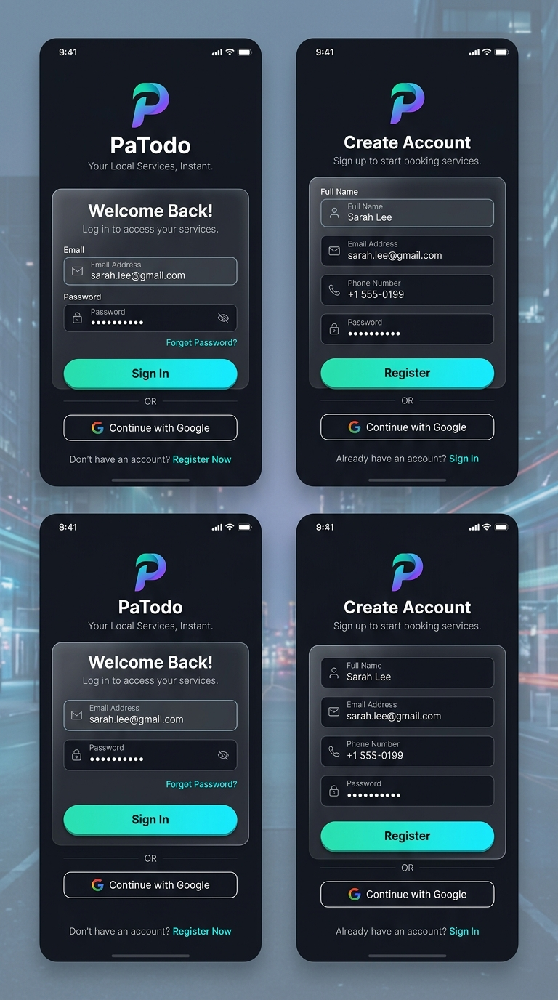
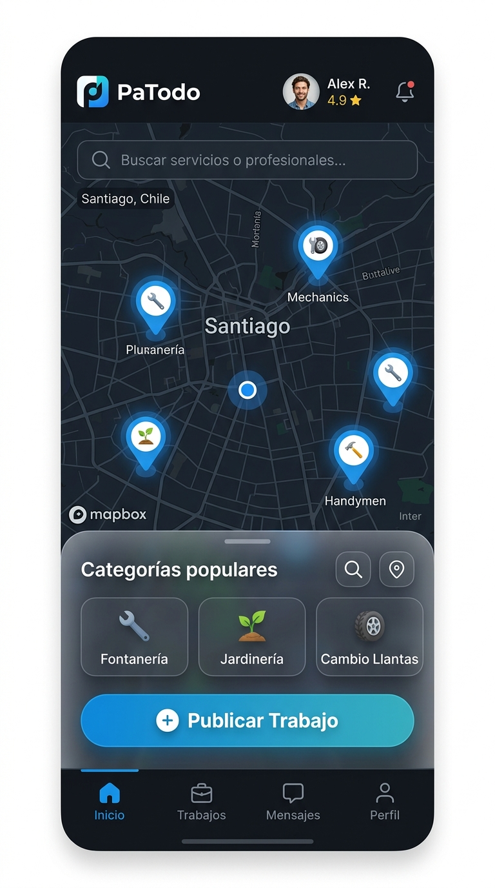
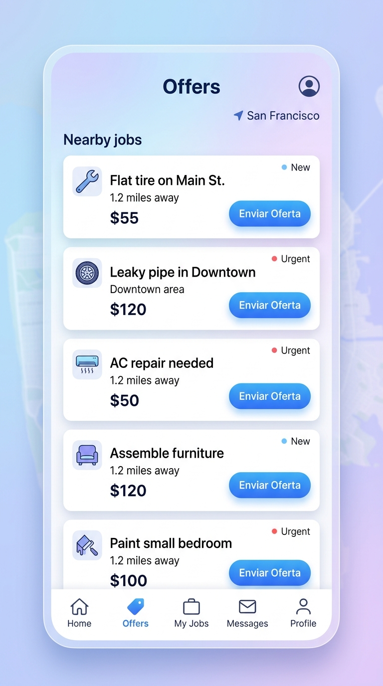

# Manual de Usuario - PaTodo

Bienvenido a **PaTodo**, la plataforma bajo demanda que te conecta rápidamente con profesionales de confianza para resolver tus necesidades al instante (plomería, jardinería, cambio de llantas, etc.).

---

## 1. Registro e Inicio de Sesión
Para utilizar PaTodo (ya sea para contratar o para ofrecer servicios), necesitas crear una cuenta.
1. Abre la aplicación.
2. Selecciona **Registrarse** para crear una nueva cuenta o **Continuar con Google** para acceso rápido.
3. Completa tu perfil indicando tus datos y seleccionando el rol con el que deseas operar:
   - **Cliente:** Para publicar trabajos y contratar servicios.
   - **Trabajador:** Para recibir ofertas y brindar servicios.
   - **Ambos:** Para tener la capacidad de hacer las dos cosas.

  

---

## 2. Modo Cliente: Publicar Trabajos
Si necesitas ayuda con un servicio:
1. En la pantalla principal **Inicio**, verás un mapa interactivo mostrando a los trabajadores que se encuentran cerca de ti.
2. Toca en el botón **+ Publicar Trabajo** o selecciona rápidamente una de las *Categorías populares* (ej. Fontanería, Jardinería, Mecánica).
3. Describe el problema, define la ubicación exacta y sugiere el precio que estás dispuesto a pagar.
4. ¡Listo! Tu solicitud será visible para los profesionales cercanos. Revisa las notificaciones para ver las ofertas que recibas.

  

---

## 3. Modo Trabajador: Buscar y Ofertar
Si eres un profesional ofreciendo tus servicios:
1. Dirígete a la pestaña de **Trabajos** u **Ofertas**.
2. Verás una lista actualizada de los trabajos solicitados cerca de tu ubicación. Las tarjetas de trabajo incluyen el título, la distancia, la urgencia y el precio propuesto por el cliente.
3. Toca en **Enviar Oferta** en el trabajo que te interese.
4. Podrás aceptar el precio sugerido o proponer uno distinto, además de indicar el tiempo estimado de llegada al lugar.

  

---

## 4. Comunicación y Finalización
- **Chat y Llamadas Seguras:** Una vez que el cliente acepta una oferta, se habilitará un chat privado en la pestaña **Mensajes**. También podrán iniciar llamadas de voz directamente desde la app sin exponer sus números de teléfono personales.
- **Navegación:** La aplicación calculará la ruta óptima para que el trabajador pueda llegar al destino sin problemas.
- **Calificación:** Al terminar el trabajo de forma exitosa, el cliente tendrá la opción de dejar una reseña y calificar el servicio (1 a 5 estrellas). ¡Mantener una buena calificación te ayudará a conseguir más ofertas!
